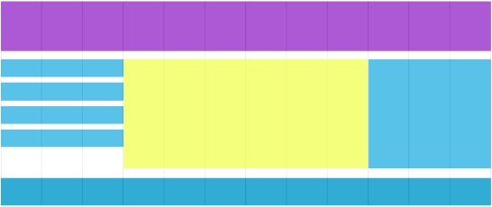

## Exercise 1 - done with the lecturer

> ### Setup
> Modify `gulpfile.js` so that the `entryPath` variable points to:
> -  `05_Day_3/03_Grid/01_Exercise_1`
>
> **Remember that after each change in `gulpfile.js` you should stop Gulp (`CTRL+C`) and run it again (`gulp`).**

Create a 12-column grid with the use of Sass. Nest elements appropriately so that columns cannot be used without rows or without the main container. Use grid to align 3 elements side by side.

## Exercise 2

> ### Setup
> Modify `gulpfile.js` so that the `entryPath` variable points to:
> -  `05_Day_3/03_Grid/02_Exercise_2`
>
> **Remember that after each change in `gulpfile.js` you should stop Gulp (`CTRL+C`) and run it again (`gulp`).**

Prepare a simple page based on a column system to reproduce the image below. Use the grid that you have created earlier with your lecturer.

