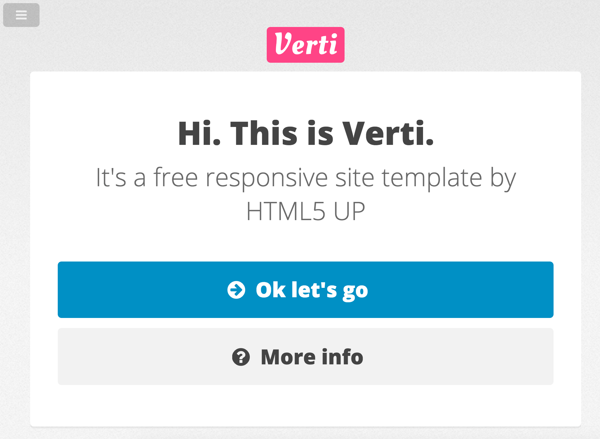
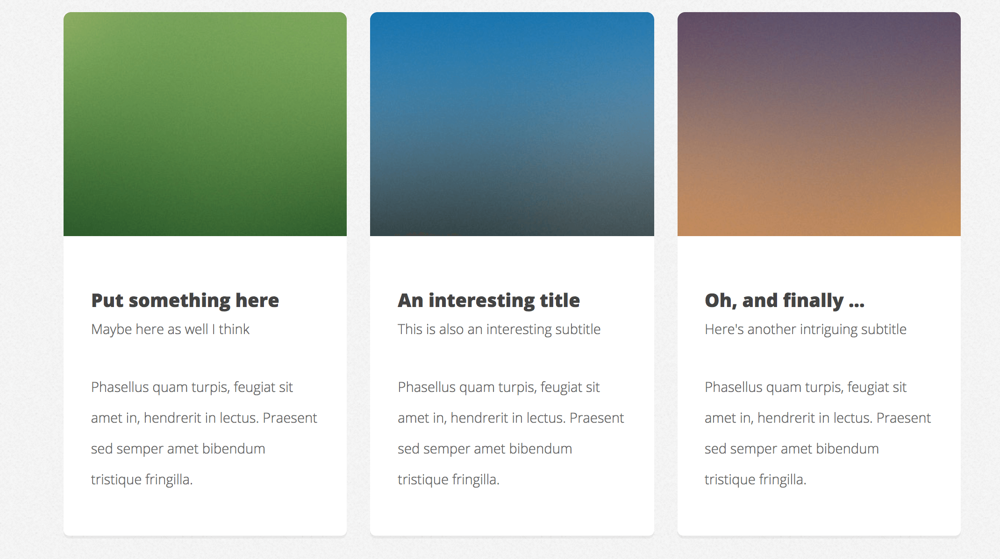
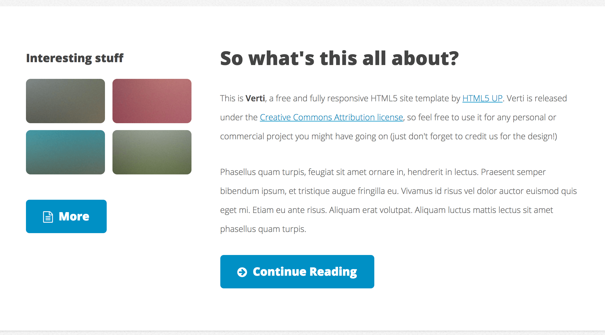
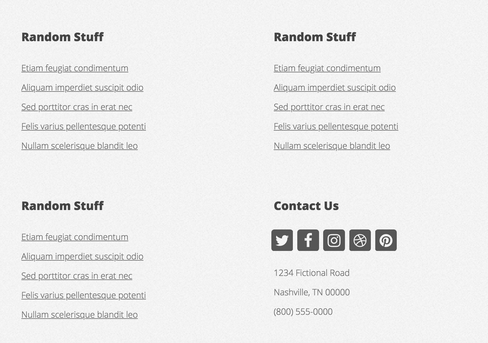

## Verti

We are about to create a webpage. The fully functional website can be seen here: [https://html5up.net/verti](https://html5up.net/verti).

> ### Setup
> Modify `gulpfile.js` so that the `entryPath` variable points to:
> 
> -  `05_Day_3/04_Flexbox/01_Verti`
>
> **Remember that after each change in `gulpfile.js` you should stop Gulp (`CTRL+C`) and run it again (`gulp`).**

---

## Attention!

The task is so extensive that it takes almost a whole day of classes to complete it. Therefore, **if you fail to complete it on the third day, you need to finish the whole project on the next day!**

---

### Part 1 - Done with the lecturer

Create a fully functional project, which includes:

- creating directory and file structure
- adding `reset.css`
- attaching fonts, icons, etc.
- running the project in Gulp

### Part 2 - Done with the lecturer

Using flexbox and the knowledge about RWD, create the following section. They should be created in the order shown below. Start with the mobile view.

Hints:

- Font used in the project - Open-Sans [https://fonts.google.com/specimen/Open+Sans](https://fonts.google.com/specimen/Open+Sans)
- Icons come from font-awesome (you can use cdn: [https://cdnjs.com/libraries/font-awesome](https://cdnjs.com/libraries/font-awesome))
- Arrow icon class - `fas fa-arrow-circle-right`
- Question mark icon class - `fas fa-question-circle`
- Page background - `#E4E4E4`
- Font color - `#444444`
- Logo background - `#FC4887` (this is the text in a rectangle)
- Blue button border - `#1691C3`
- The navigation should appear under the logo **Verti** after pressing the hamburger icon. **Do not use JavaScript!** Hamburger icon should be a non-standard `checkbox` element. Example: [https://codepen.io/mutedblues/pen/MmPNPG](https://codepen.io/mutedblues/pen/MmPNPG).

#### Mobile

#### Tablet

#### Desktop

---

## Exercises to do on your own

### Part 1

Using **Grid** and the knowledge about RWD, create the following section:

Hints:

- Images are in the `assets` directory

#### Mobile

#### Tablet and Desktop

### Part 2

Using flexbox or grid, and the knowledge about RWD, create the following section:

Hints:

- Images are in the `assets` directory
- Document icon class  `fas fa-file-alt`

#### Mobile and Tablet

#### Desktop

### Part 3

Using flexbox and the knowledge about RWD, create the following section:

Hints:

- Twitter icon class - `fab fa-twitter`
- Facebook icon class - `fab fa-facebook`
- Instagram icon class - `fab fa-instagram`
- Dribbble icon class - `fa-dribbble`
- Pinterest icon class - `fab fa-pinterest`

#### Mobile

#### Tablet

#### Desktop

