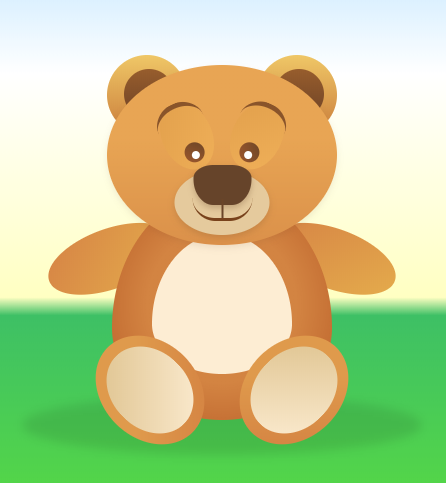

## Exercise 1 - Bear - done with the lecturer

> ### Setup
> Modify `gulpfile.js` so that the `entryPath` variable points to:
> -  `07_Day_4/02_Animations/01_Bear`
>
> **Remember that after each change in `gulpfile.js` you should stop Gulp (`CTRL+C`) and run it again (`gulp`).**

Try to move the paw or eye of the bear. The bear was made using HTML elements.




## Exercises to do on your own

> ### Setup
> Modify `gulpfile.js` so that the `entryPath` variable points to:
> -  `07_Day_4/02_Animations/02_Exercises`
>
> **Remember that after each change in `gulpfile.js` you should stop Gulp (`CTRL+C`) and run it again (`gulp`).**


### Exercise 1

Create loading animations which are shown on the gif image below.


For the first animation you will need 2 elements - a frame and a sphere.

For the second animation you need a single element which you will rotate.

The third animation will be made on 5 elements arranged next to each other.   
Use animation delay here, which you can apply to the n-th elements.   
The ideal solution here is to use Sass loop.


### Exercise 2

In index.html you will find a section with **.exercise2** class.

Create any animations that will appear when you hover over the buttons.
Remember that you can use any property, e.g.
`scale`, `box-shadow`, `text-shadow`, `border-radius`, `padding`, `background`, etc.

You can find some examples on the following pages:
 - [https://tympanus.net/Development/CreativeButtons/](https://tympanus.net/Development/CreativeButtons/ )
 - [https://tympanus.net/Development/ButtonStylesInspiration/](https://tympanus.net/Development/ButtonStylesInspiration/)


### Exercise 3

On the page there is a sample section with a portfolio containing projects.

Use CSS to add nice effects after hovering over the thumbnails.

Examples you can follow: [https://tympanus.net/Development/HoverEffectIdeas/](https://tympanus.net/Development/HoverEffectIdeas/).

For example, you can apply an effect like this:
- in the state of rest (no `hover`) title and text are invisible (`opacity: 0;`)
- when you hover over a portfolio element, show title and text
- additionally, scale and rotate image on hover


## Zombie Animation

> ### Setup
> Modify `gulpfile.js` so that the `entryPath` variable points to:
> -  `07_Day_4/02_Animations/03_Zombie`
>
> **Remember that after each change in `gulpfile.js` you should stop Gulp (`CTRL+C`) and run it again (`gulp`).**

Create an animation of a walking zombie using CSS sprite.
Link to the image: [https://wdrfree.com/public/demos/animatespritekeyframes/walkingdead.png](https://wdrfree.com/public/demos/animatespritekeyframes/walkingdead.png).

Hint:
- dimensions of a single animation frame: 200x312 px,
- number of frames: 10.

Tutorial - if you need it: [http://blog.teamtreehouse.com/css-sprite-sheet-animations-steps](http://blog.teamtreehouse.com/css-sprite-sheet-animations-steps).


### Additional - for volunteers
Just like with a few other properties, here we can add many animations to an element, separating them with a comma, e.g.
```
animation: myAnim1 3s 0s, myAnim2 5s 0s alternate;
```
Add an additional animation to the zombie that will be done **once** and will move it from the right side of the screen to the left (and leave the zombie on the left). Apply appropriate properties of the animation here. To get such a movement, use absolute positioning for the zombie, like in the following graphic. The **.zombie** element should be inside the **.board** element. After the animation is finished, the zombie should be invisible on the left side of the board.


## Rocket Animation

> ### Setup
> Modify `gulpfile.js` so that the `entryPath` variable points to:
> -  `07_Day_4/02_Animations/04_Rocket`
>
> **Remember that after each change in `gulpfile.js` you should stop Gulp (`CTRL+C`) and run it again (`gulp`).**

Thanks to CSS animation, visit all of the planets with a rocket.
This will require rotating the rocket and moving it to appropriate positions.

Making a long single animation can be problematic in this case, because it is hard to assess how many percent a given phase of movement should take and then combine it all into one long flight.

It will be much easier to create 4 separate animations that you add to the rocket (separated with commas, just like in the previous exercise). Each of those animations will be responsible for a single flight to the next planet.

The beginning of the animation is an appropriate turn - so that the rocket does not fly facing backwards - followed by a flight to the coordinates of the next planet.

Subsequent animations should start with an appropriate delay. After the end of the flight, you can award yourself an Ace of Space diploma.
